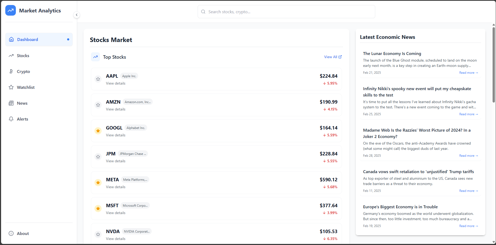
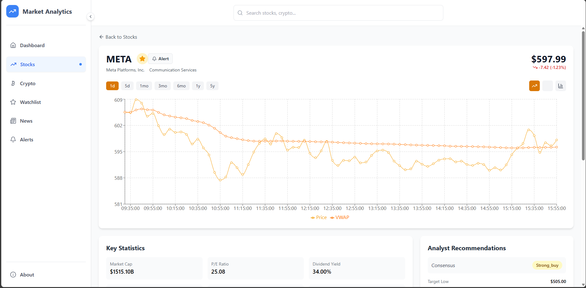
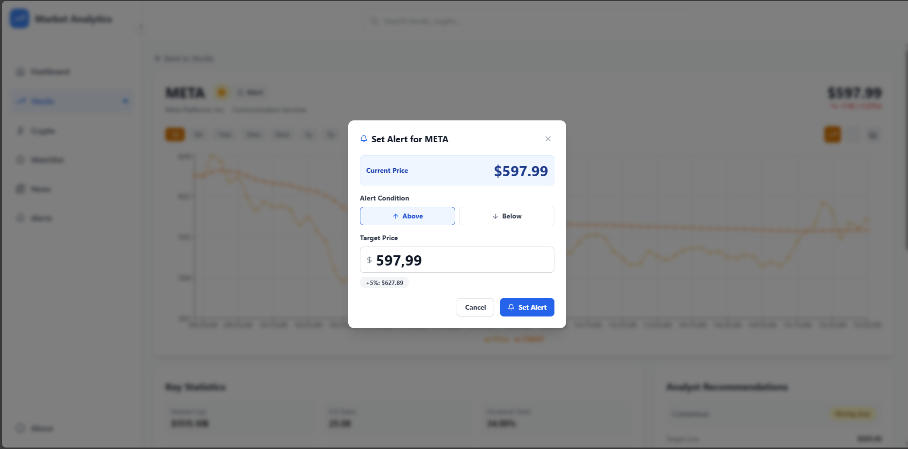

# Market Analytics Dashboard

<div align="center">



**A comprehensive financial market analytics platform built with React & Flask**

[](https://reactjs.org/)
[](https://flask.palletsprojects.com/)
[](https://tailwindcss.com/)
[](https://recharts.org/)
[](https://www.python.org/)

</div>

## 📋 Overview

Market Analytics Dashboard is a full-stack web application that provides comprehensive financial market data visualization and analysis tools. It allows users to track stocks, cryptocurrencies, market trends, and financial news in a modern, intuitive interface.

The application integrates multiple financial data sources and presents them in an interactive dashboard with real-time updates, customizable watchlists, and powerful price alert notifications. User preferences, watchlists, and alert configurations are efficiently stored in browser localStorage, ensuring fast performance and persistent settings without server-side storage requirements.

An advanced price alert system notifies users of market movements based on customizable thresholds, supporting both percentage and absolute price triggers with flexible notification options.


## ✨ Features

- **📊 Real-time Market Data**
  - Interactive charts with adaptive granularity based on timeframe
  - Multiple visualization options (Line, Area, Bar)
  - Support for various timeframes (1d, 5d, 1mo, 3mo, 6mo, 1y, 5y)

- **🔍 Powerful Search**
  - Unified search across stocks and cryptocurrencies
  - Instant results with company/asset information

- **📈 Comprehensive Analysis**
  - Sector-based performance tracking
  - Market breadth visualization
  - Technical indicators (RSI, VWAP, EMA, SMA)
  - Company fundamentals and financials

- **📱 User Experience**
  - Responsive design for all devices
  - Interactive data visualization
  - Modern UI with intuitive navigation

- **⚙️ Core Functionality**
  - Customizable watchlists
  - Price alerts system
  - Financial news aggregation
  - Detailed asset views (stocks & crypto)

## 🖥️ Screenshots

<div align="center">
  
  
  
</div>

## 🏗️ Architecture

### Frontend (React)
- Single-page application with React Router
- Component-based architecture with reusable UI elements
- State management with React Hooks
- Real-time data visualization with Recharts
- Responsive styling with TailwindCSS

### Backend (Flask)
- RESTful API architecture
- Data aggregation from multiple financial sources
- Efficient caching and request handling
- Endpoint-based service structure

## 🛠️ Tech Stack

| Component | Technologies |
|-----------|-------------|
| **Frontend** | React 19, React Router 7, Recharts 2, TailwindCSS 3, Lucide React |
| **Backend** | Flask 3, Flask-CORS, Python 3.8+ |
| **Data Sources** | CoinGecko API, NewsAPI, Yahoo Finance API |
| **Dev Tools** | npm, pip, Git |

## 📡 API Endpoints

### Stock Data Endpoints

| Method | Endpoint | Description |
|--------|----------|-------------|
| `GET` | `/api/stock_data/{ticker}?period={timeframe}` | Get historical stock data with specified timeframe |
| `GET` | `/api/technical_indicators/{ticker}` | Get technical indicators for a specific stock |
| `GET` | `/api/market_overview` | Get overall market statistics and performance |
| `GET` | `/api/stocks_by_sector?sector={sector}` | Get stocks filtered by industry sector |
| `GET` | `/api/stock_batch?symbols={symbols}` | Get data for multiple stocks in a single request |
| `GET` | `/api/top_stocks` | Get top performing stocks |

### Crypto Data Endpoints

| Method | Endpoint | Description |
|--------|----------|-------------|
| `GET` | `/api/crypto_data/{symbol}?period={timeframe}` | Get historical cryptocurrency data |
| `GET` | `/api/crypto_market_overview` | Get crypto market statistics and performance |
| `GET` | `/api/cryptos_by_category?category={category}` | Get cryptocurrencies by category |
| `GET` | `/api/crypto_batch?symbols={symbols}` | Get data for multiple cryptocurrencies |
| `GET` | `/api/top_cryptos` | Get top cryptocurrencies by market cap |

### News & Search Endpoints

| Method | Endpoint | Description |
|--------|----------|-------------|
| `GET` | `/api/financial_news` | Get general financial news |
| `GET` | `/api/crypto_news` | Get cryptocurrency news |
| `GET` | `/api/market_news` | Get specific market-related news |
| `GET` | `/api/unified_search?query={query}` | Search across stocks and cryptocurrencies |

## 🚀 Getting Started

### Prerequisites
- Node.js 14+ and npm
- Python 3.8+
- API keys for:
  - CoinGecko API
  - NewsAPI


### Installation

This project requires API keys from external services to function properly. Follow these steps to configure your API keys:

### Required API Keys

1. **CoinGecko API** - Used for cryptocurrency data
   - Sign up at [CoinGecko API](https://www.coingecko.com/en/api/pricing)
   - Free tier has limited request rate but is sufficient for development

2. **NewsAPI** - Used for financial news
   - Sign up at [NewsAPI](https://newsapi.org/register)
   - Free tier provides 100 requests/day

1. **Clone the repository**
   ```bash
   git clone https://github.com/zaninifrancesco/market-analytics-dashboard.git
   cd market-analytics-dashboard


2. **Setup backend**
   ```bash
   cd backend
   pip install -r requirements.txt
   cp .env.example .env      # Edit with your API keys
   ```

3. **Setup frontend**
   ```bash
   cd ../frontend
   npm install
   ```

4. **Run the application**
   ```bash
   # Terminal 1 - Backend
   cd backend
   python app.py

   # Terminal 2 - Frontend
   cd frontend
   npm start
   ```

5. **Open your browser**
   Navigate to `http://localhost:3000`

## 📁 Project Structure

```
market-analytics-dashboard/
├── backend/
│   ├── app.py                 # Main Flask application
│   ├── config.py              # Configuration settings
│   ├── requirements.txt       # Python dependencies
│   ├── api/                   # API endpoints
│   │   ├── routes/
│   │   │   ├── stocks.py
│   │   │   ├── crypto.py
│   │   │   └── news.py
│   │   └── services/
│   │       ├── data_fetcher.py
│   │       └── data_processor.py
│   └── utils/
│       ├── cache.py
│       └── error_handler.py
│
├── frontend/
│   ├── public/
│   ├── src/
│   │   ├── components/
│   │   │   ├── common/
│   │   │   ├── dashboard/
│   │   │   ├── stocks/
│   │   │   └── crypto/
│   │   ├── pages/
│   │   ├── services/
│   │   ├── hooks/
│   │   ├── utils/
│   │   ├── App.js
│   │   └── index.js
│   ├── package.json
│   └── tailwind.config.js
│
├── screenshots/
├── dashboard.png
└── README.md
```

## 🤝 Contributing

Contributions are welcome! Please feel free to submit a Pull Request.

1. Fork the project
2. Create your feature branch (`git checkout -b feature/amazing-feature`)
3. Commit your changes (`git commit -m 'Add some amazing feature'`)
4. Push to the branch (`git push origin feature/amazing-feature`)
5. Open a Pull Request

## 📄 License

This project is licensed under the MIT License - see the [LICENSE](LICENSE) file for details.

## Acknowledgements

- [CoinGecko API](https://www.coingecko.com/en/api) for cryptocurrency data
- [NewsAPI](https://newsapi.org/) for financial news
- [Yahoo Finance API](https://finance.yahoo.com/) for stock market data
## 📊 Implementation Details

### Adaptive Chart Granularity
The application automatically selects the appropriate data intervals based on the requested timeframe:

- **1d**: 5-minute intervals
- **5d**: 1-hour intervals
- **1mo**: Daily intervals
- **3mo/6mo**: Daily intervals
- **1y**: Monthly intervals
- **5y**: Monthly intervals

### Component Architecture
- **Reusable UI components**: Cards, charts, loading states
- **Modular page structure**: Easy extension and maintenance
- **Consistent styling**: TailwindCSS utility classes for responsive design

### Data Processing
- **Efficient formatting**: Optimized for chart visualization
- **On-demand fetching**: Minimizes load times and API calls
- **Error handling**: Graceful degradation and user feedback